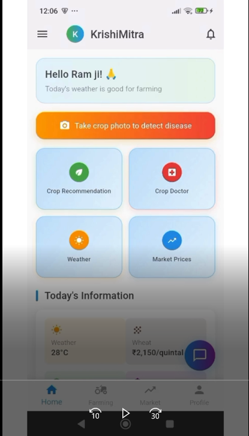
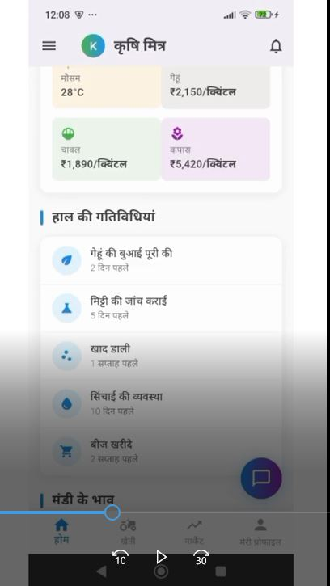
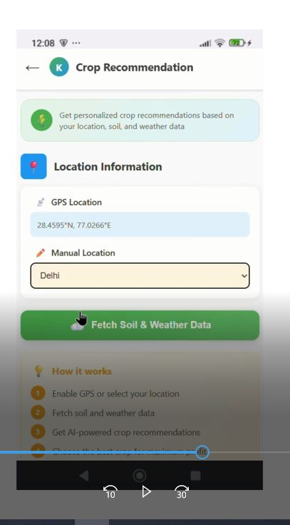
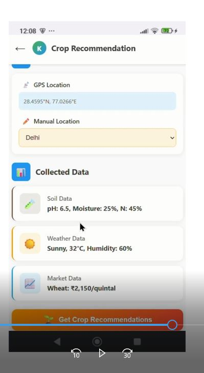
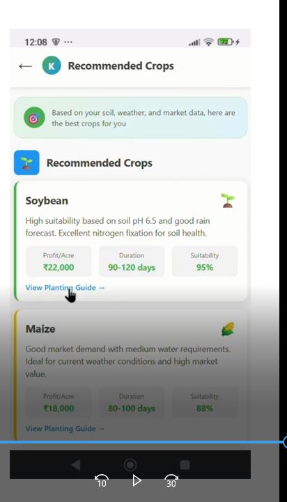

# 🌾 KrishiMitra

**KrishiMitra** is a smart farming companion designed to make agriculture simpler and more productive for rural farmers.  
It uses **AI-powered crop recommendations, disease detection, real-time weather, and market insights** to help farmers make better decisions.  

---

## 📱 App Screenshots

<p align="center">
  
  
  
  
  
  
  
  
</p>

---

## ✨ Key Features

- 📷 **Crop Doctor** – Detect crop diseases by analyzing leaf images  
- 🌱 **Crop Recommendation** – Suggests best crops based on soil, weather & market trends  
- ☀️ **Weather & Market Prices** – Real-time updates to guide farming decisions  
- 📅 **Farming Calendar** – Month-wise crop care schedules with tutorials  
- 🧑‍🌾 **Expert Advice & Learning Hub** – Videos, guides, and manuals (works offline too)  
- 🏛️ **Government Schemes & Subsidy Alerts** – Instant updates on policies  

---

## 🚀 Getting Started

### Prerequisites
- Flutter SDK installed  
- Android Studio / Xcode  

### Installation

```bash
git clone https://github.com/singhanita154-pixel/krishimitra.git
cd krishimitra
flutter pub get
flutter run
